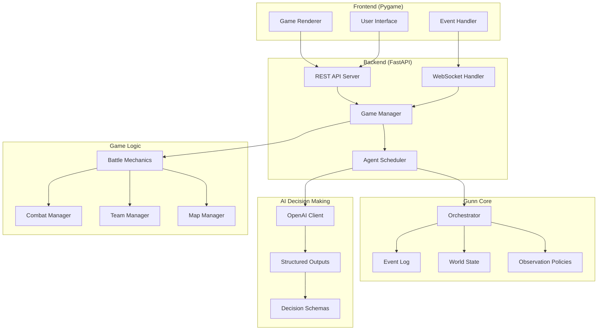
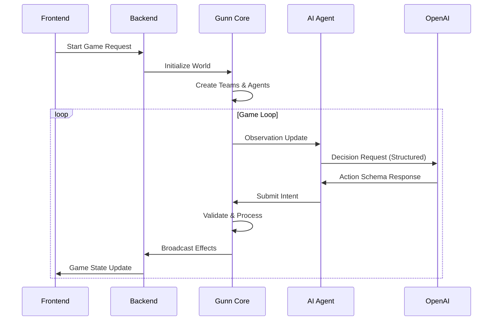

# Design Document

## Overview

The multi-agent battle demo is a comprehensive showcase of Gunn's capabilities through a 2D real-time strategy simulation. Two teams of 3 CPU agents each engage in tactical combat while demonstrating Gunn's orchestration, observation policies, agent coordination, and streaming capabilities. The system uses OpenAI's structured outputs for AI decision-making, FastAPI for backend services, and Pygame for frontend visualization.

This demo serves as both an engaging demonstration and a reference implementation for developers learning to integrate Gunn into their own projects. It highlights key features including partial observation, team-based communication, concurrent action execution, and intelligent agent behavior.

## Architecture

### High-Level System Architecture



### Component Interaction Flow



## Components and Interfaces

### 1. Game World Model

#### World State Structure
```python
from pydantic import BaseModel, Field
from typing import Dict, List, Tuple, Optional
from enum import Enum

class AgentStatus(str, Enum):
    ALIVE = "alive"
    DEAD = "dead"
    HEALING = "healing"

class WeaponCondition(str, Enum):
    EXCELLENT = "excellent"
    GOOD = "good"
    DAMAGED = "damaged"
    BROKEN = "broken"

class LocationType(str, Enum):
    OPEN_FIELD = "open_field"
    FORGE = "forge"
    COVER = "cover"
    SPAWN_POINT = "spawn_point"

class Agent(BaseModel):
    agent_id: str
    team: str  # "team_a" or "team_b"
    position: Tuple[float, float]
    health: int = Field(default=100, ge=0, le=100)
    status: AgentStatus = AgentStatus.ALIVE
    weapon_condition: WeaponCondition = WeaponCondition.EXCELLENT
    last_action_time: float = 0.0
    communication_range: float = 50.0
    vision_range: float = 30.0
    attack_range: float = 15.0

class MapLocation(BaseModel):
    position: Tuple[float, float]
    location_type: LocationType
    radius: float = 5.0
    metadata: Dict[str, Any] = Field(default_factory=dict)

class BattleWorldState(BaseModel):
    agents: Dict[str, Agent] = Field(default_factory=dict)
    map_locations: Dict[str, MapLocation] = Field(default_factory=dict)
    team_scores: Dict[str, int] = Field(default_factory=dict)
    game_time: float = 0.0
    game_status: str = "active"  # "active", "team_a_wins", "team_b_wins"
    last_communication: Dict[str, List[Dict]] = Field(default_factory=dict)
```

#### Gunn Integration Layer
```python
from gunn import Orchestrator, OrchestratorConfig
from gunn.policies.observation import ObservationPolicy
from gunn.schemas.types import Intent, Effect

class BattleObservationPolicy(ObservationPolicy):
    """Team-based observation policy with fog of war and team-only communication"""
    
    def __init__(self, team: str, vision_range: float = 30.0):
        self.team = team
        self.vision_range = vision_range
    
    def filter_world_state(self, world_state: WorldState, agent_id: str) -> View:
        """Filter world state based on team membership and vision range"""
        agent = world_state.entities.get(agent_id)
        if not agent:
            return View(agent_id=agent_id, view_seq=0, visible_entities={}, 
                       visible_relationships={}, context_digest="")
        
        visible_entities = {}
        agent_pos = world_state.spatial_index.get(agent_id, (0, 0, 0))
        
        # Always see self and teammates
        for entity_id, entity in world_state.entities.items():
            if entity.get("team") == self.team:
                visible_entities[entity_id] = entity
            else:
                # Check vision range for enemies
                entity_pos = world_state.spatial_index.get(entity_id, (0, 0, 0))
                distance = ((agent_pos[0] - entity_pos[0])**2 + 
                           (agent_pos[1] - entity_pos[1])**2)**0.5
                if distance <= self.vision_range:
                    # Partial information about enemies
                    visible_entities[entity_id] = {
                        "agent_id": entity_id,
                        "team": entity.get("team"),
                        "position": entity.get("position"),
                        "status": entity.get("status")
                    }
        
        # Always see map locations
        for loc_id, location in world_state.entities.items():
            if location.get("type") == "map_location":
                visible_entities[loc_id] = location
        
        # Include team communications (team-only visibility)
        team_messages = world_state.metadata.get("team_communications", {}).get(self.team, [])
        if team_messages:
            visible_entities["team_communications"] = {
                "type": "communications",
                "messages": team_messages[-10:]  # Last 10 messages
            }
        
        return View(
            agent_id=agent_id,
            view_seq=0,  # Will be set by Gunn
            visible_entities=visible_entities,
            visible_relationships={},
            context_digest=""  # Will be calculated by Gunn
        )
    
    def should_observe_communication(self, effect: Effect, agent_id: str) -> bool:
        """Determine if agent should see a communication effect"""
        if effect["kind"] != "TeamMessage":
            return True  # Non-communication effects follow normal rules
        
        # Only show team messages to team members
        sender_team = effect["payload"].get("sender_team")
        agent_team = self.team
        
        return sender_team == agent_team

class BattleOrchestrator:
    """Wrapper around Gunn orchestrator for battle simulation"""
    
    def __init__(self):
        config = OrchestratorConfig(
            max_agents=6,
            staleness_threshold=1,
            debounce_ms=50.0,
            deadline_ms=3000.0,
            token_budget=500,
            backpressure_policy="defer",
            default_priority=0
        )
        
        self.orchestrator = Orchestrator(config, world_id="battle_demo")
        self.world_state = BattleWorldState()
        
    async def initialize(self):
        """Initialize the orchestrator and set up the battle world"""
        await self.orchestrator.initialize()
        await self._setup_battle_world()
    
    async def _setup_battle_world(self):
        """Create initial world state with teams and map"""
        # Create map locations
        forge_a = MapLocation(
            position=(20.0, 80.0),
            location_type=LocationType.FORGE
        )
        forge_b = MapLocation(
            position=(180.0, 20.0),
            location_type=LocationType.FORGE
        )
        
        self.world_state.map_locations = {
            "forge_a": forge_a,
            "forge_b": forge_b
        }
        
        # Create teams
        team_a_agents = []
        team_b_agents = []
        
        for i in range(3):
            # Team A agents
            agent_a = Agent(
                agent_id=f"team_a_agent_{i+1}",
                team="team_a",
                position=(30.0 + i * 10, 90.0)
            )
            team_a_agents.append(agent_a)
            
            # Team B agents
            agent_b = Agent(
                agent_id=f"team_b_agent_{i+1}",
                team="team_b",
                position=(170.0 - i * 10, 10.0)
            )
            team_b_agents.append(agent_b)
        
        # Register agents with Gunn
        for agent in team_a_agents + team_b_agents:
            policy = BattleObservationPolicy(agent.team, agent.vision_range)
            await self.orchestrator.register_agent(agent.agent_id, policy)
            
            # Add to world state
            self.world_state.agents[agent.agent_id] = agent
        
        # Initialize team scores
        self.world_state.team_scores = {"team_a": 0, "team_b": 0}
        
        # Sync with Gunn's world state
        await self._sync_world_state()
    
    async def _sync_world_state(self):
        """Synchronize our world state with Gunn's world state"""
        gunn_entities = {}
        spatial_index = {}
        
        # Add agents
        for agent_id, agent in self.world_state.agents.items():
            gunn_entities[agent_id] = agent.model_dump()
            spatial_index[agent_id] = (*agent.position, 0.0)
        
        # Add map locations
        for loc_id, location in self.world_state.map_locations.items():
            gunn_entities[loc_id] = {
                "type": "map_location",
                **location.model_dump()
            }
            spatial_index[loc_id] = (*location.position, 0.0)
        
        # Update Gunn's world state
        self.orchestrator.world_state.entities = gunn_entities
        self.orchestrator.world_state.spatial_index = spatial_index
        self.orchestrator.world_state.metadata = {
            "team_scores": self.world_state.team_scores,
            "game_time": self.world_state.game_time,
            "game_status": self.world_state.game_status
        }
```

### 2. AI Decision Making System

#### OpenAI Structured Output Schemas
```python
from pydantic import BaseModel, Field
from typing import List, Optional, Literal

class MoveAction(BaseModel):
    action_type: Literal["move"] = "move"
    target_position: Tuple[float, float] = Field(description="Target coordinates to move to")
    reason: str = Field(description="Why this move is strategic")

class AttackAction(BaseModel):
    action_type: Literal["attack"] = "attack"
    target_agent_id: str = Field(description="ID of the agent to attack")
    reason: str = Field(description="Why this target was chosen")

class HealAction(BaseModel):
    action_type: Literal["heal"] = "heal"
    target_agent_id: Optional[str] = Field(default=None, description="Agent to heal (None for self)")
    reason: str = Field(description="Why healing is needed now")

class RepairAction(BaseModel):
    action_type: Literal["repair"] = "repair"
    reason: str = Field(description="Why weapon repair is needed")

class CommunicateAction(BaseModel):
    action_type: Literal["communicate"] = "communicate"
    message: str = Field(description="Message to send to team", max_length=200)
    urgency: Literal["low", "medium", "high"] = Field(description="Message urgency level")

class AgentDecision(BaseModel):
    """Complete decision made by an agent"""
    primary_action: MoveAction | AttackAction | HealAction | RepairAction
    communication: Optional[CommunicateAction] = Field(default=None, description="Optional team communication")
    confidence: float = Field(ge=0.0, le=1.0, description="Confidence in this decision")
    strategic_assessment: str = Field(description="Current situation assessment")

class AIDecisionMaker:
    """Handles AI decision making using OpenAI structured outputs"""
    
    def __init__(self, openai_client, model: str = "gpt-4o-2024-08-06"):
        self.client = openai_client
        self.model = model
        
    async def make_decision(self, agent_id: str, observation: Dict, 
                          team_context: Dict) -> AgentDecision:
        """Generate a structured decision for an agent"""
        
        system_prompt = self._build_system_prompt(agent_id, team_context)
        user_prompt = self._build_observation_prompt(observation)
        
        try:
            response = await self.client.beta.chat.completions.parse(
                model=self.model,
                messages=[
                    {"role": "system", "content": system_prompt},
                    {"role": "user", "content": user_prompt}
                ],
                response_format=AgentDecision,
                temperature=0.7,
                max_tokens=1000
            )
            
            return response.choices[0].message.parsed
            
        except Exception as e:
            # Fallback to safe default action
            return AgentDecision(
                primary_action=MoveAction(
                    target_position=(100.0, 100.0),
                    reason="Error in decision making, moving to center"
                ),
                confidence=0.1,
                strategic_assessment=f"Decision error: {str(e)}"
            )
    
    def _build_system_prompt(self, agent_id: str, team_context: Dict) -> str:
        """Build system prompt with agent role and team strategy"""
        team = team_context.get("team", "unknown")
        teammates = team_context.get("teammates", [])
        
        return f"""You are {agent_id}, a tactical combat agent on {team}.

Your teammates are: {', '.join(teammates)}

COMBAT RULES:
- Health: 0-100 points, you die at 0
- Weapons degrade with use: excellent → good → damaged → broken
- Broken weapons cannot attack and must be repaired at your team's forge
- Healing takes time and leaves you vulnerable
- You can only communicate with teammates (enemies cannot hear you)
- Vision range is limited - you may not see all enemies

STRATEGIC PRIORITIES:
1. Survive and eliminate enemy team
2. Coordinate with teammates through communication
3. Maintain weapon condition
4. Use tactical positioning and cover

DECISION MAKING:
- Consider your health, weapon condition, and position
- Communicate important information to teammates
- Balance aggression with survival
- Adapt to changing battlefield conditions

Make tactical decisions that help your team win while keeping yourself alive."""

    def _build_observation_prompt(self, observation: Dict) -> str:
        """Build observation prompt from current game state"""
        visible_entities = observation.get("visible_entities", {})
        
        # Extract agent info
        agent_info = None
        teammates = []
        enemies = []
        map_locations = []
        
        for entity_id, entity in visible_entities.items():
            if entity.get("type") == "map_location":
                map_locations.append(f"- {entity_id}: {entity.get('location_type')} at {entity.get('position')}")
            elif "agent" in entity_id:
                if entity_id == observation.get("agent_id"):
                    agent_info = entity
                elif entity.get("team") == agent_info.get("team") if agent_info else False:
                    teammates.append(f"- {entity_id}: Health {entity.get('health', '?')}, Position {entity.get('position', '?')}, Status {entity.get('status', '?')}")
                else:
                    enemies.append(f"- {entity_id}: Position {entity.get('position', '?')}, Status {entity.get('status', '?')}")
        
        prompt = f"""CURRENT SITUATION:

YOUR STATUS:
- Health: {agent_info.get('health', 'unknown') if agent_info else 'unknown'}
- Position: {agent_info.get('position', 'unknown') if agent_info else 'unknown'}
- Weapon Condition: {agent_info.get('weapon_condition', 'unknown') if agent_info else 'unknown'}
- Status: {agent_info.get('status', 'unknown') if agent_info else 'unknown'}

TEAMMATES VISIBLE:
{chr(10).join(teammates) if teammates else "- None visible"}

ENEMIES VISIBLE:
{chr(10).join(enemies) if enemies else "- None visible"}

MAP LOCATIONS:
{chr(10).join(map_locations) if map_locations else "- None visible"}

Based on this situation, make your tactical decision. Consider both immediate actions and team communication."""

        return prompt
```

### 3. Game Mechanics and Combat System

#### Battle Mechanics
```python
import asyncio
import random
from typing import Dict, List, Tuple

class BattleMechanics:
    """Handles combat calculations and game rules"""
    
    def __init__(self):
        self.attack_damage = 25
        self.heal_amount = 30
        self.weapon_degradation_rate = 0.1
        self.movement_speed = 5.0
        self.attack_cooldown = 2.0
        self.heal_cooldown = 3.0
        
    def calculate_attack_damage(self, attacker: Agent, target: Agent, distance: float) -> int:
        """Calculate damage based on weapon condition and distance"""
        if attacker.weapon_condition == WeaponCondition.BROKEN:
            return 0
        
        base_damage = self.attack_damage
        
        # Weapon condition modifier
        condition_modifiers = {
            WeaponCondition.EXCELLENT: 1.0,
            WeaponCondition.GOOD: 0.8,
            WeaponCondition.DAMAGED: 0.6,
            WeaponCondition.BROKEN: 0.0
        }
        
        damage = base_damage * condition_modifiers[attacker.weapon_condition]
        
        # Distance modifier (closer = more damage)
        if distance <= 5.0:
            damage *= 1.2  # Close range bonus
        elif distance > attacker.attack_range:
            damage = 0  # Out of range
        
        # Add some randomness
        damage *= random.uniform(0.8, 1.2)
        
        return max(0, int(damage))
    
    def degrade_weapon(self, agent: Agent) -> WeaponCondition:
        """Degrade weapon condition after use"""
        conditions = list(WeaponCondition)
        current_index = conditions.index(agent.weapon_condition)
        
        if random.random() < self.weapon_degradation_rate:
            new_index = min(current_index + 1, len(conditions) - 1)
            agent.weapon_condition = conditions[new_index]
        
        return agent.weapon_condition
    
    def can_perform_action(self, agent: Agent, action_type: str, current_time: float) -> bool:
        """Check if agent can perform the requested action"""
        if agent.status != AgentStatus.ALIVE:
            return False
        
        time_since_last = current_time - agent.last_action_time
        
        if action_type == "attack" and time_since_last < self.attack_cooldown:
            return False
        elif action_type == "heal" and time_since_last < self.heal_cooldown:
            return False
        
        return True
    
    def calculate_movement_time(self, start_pos: Tuple[float, float], 
                              end_pos: Tuple[float, float]) -> float:
        """Calculate time needed for movement"""
        distance = ((end_pos[0] - start_pos[0])**2 + (end_pos[1] - start_pos[1])**2)**0.5
        return distance / self.movement_speed
    
    def is_at_forge(self, agent: Agent, forge_locations: Dict[str, MapLocation]) -> bool:
        """Check if agent is at their team's forge"""
        team_forge = f"forge_{agent.team.split('_')[1]}"  # team_a -> forge_a
        
        if team_forge not in forge_locations:
            return False
        
        forge = forge_locations[team_forge]
        distance = ((agent.position[0] - forge.position[0])**2 + 
                   (agent.position[1] - forge.position[1])**2)**0.5
        
        return distance <= forge.radius

class CombatManager:
    """Manages combat resolution and effects"""
    
    def __init__(self, battle_mechanics: BattleMechanics):
        self.mechanics = battle_mechanics
        
    async def process_attack(self, attacker_id: str, target_id: str, 
                           world_state: BattleWorldState) -> List[Effect]:
        """Process an attack and return resulting effects"""
        effects = []
        
        attacker = world_state.agents.get(attacker_id)
        target = world_state.agents.get(target_id)
        
        if not attacker or not target:
            return effects
        
        # Calculate distance
        distance = ((attacker.position[0] - target.position[0])**2 + 
                   (attacker.position[1] - target.position[1])**2)**0.5
        
        # Check if attack is valid
        if distance > attacker.attack_range:
            effects.append({
                "kind": "AttackFailed",
                "payload": {
                    "attacker_id": attacker_id,
                    "target_id": target_id,
                    "reason": "out_of_range",
                    "distance": distance,
                    "max_range": attacker.attack_range
                },
                "source_id": "combat_manager",
                "schema_version": "1.0.0"
            })
            return effects
        
        # Calculate damage
        damage = self.mechanics.calculate_attack_damage(attacker, target, distance)
        
        if damage > 0:
            # Apply damage
            new_health = max(0, target.health - damage)
            
            effects.append({
                "kind": "AgentDamaged",
                "payload": {
                    "attacker_id": attacker_id,
                    "target_id": target_id,
                    "damage": damage,
                    "new_health": new_health,
                    "position": target.position
                },
                "source_id": "combat_manager",
                "schema_version": "1.0.0"
            })
            
            # Check if target died
            if new_health == 0:
                effects.append({
                    "kind": "AgentDied",
                    "payload": {
                        "agent_id": target_id,
                        "killer_id": attacker_id,
                        "position": target.position
                    },
                    "source_id": "combat_manager",
                    "schema_version": "1.0.0"
                })
        
        # Degrade attacker's weapon
        old_condition = attacker.weapon_condition
        new_condition = self.mechanics.degrade_weapon(attacker)
        
        if old_condition != new_condition:
            effects.append({
                "kind": "WeaponDegraded",
                "payload": {
                    "agent_id": attacker_id,
                    "old_condition": old_condition.value,
                    "new_condition": new_condition.value
                },
                "source_id": "combat_manager",
                "schema_version": "1.0.0"
            })
        
        return effects
    
    async def process_heal(self, healer_id: str, target_id: str, 
                          world_state: BattleWorldState) -> List[Effect]:
        """Process a healing action and return resulting effects"""
        effects = []
        
        healer = world_state.agents.get(healer_id)
        target = world_state.agents.get(target_id)
        
        if not healer or not target:
            return effects
        
        # Check if healing is valid
        if target.health >= 100:
            effects.append({
                "kind": "HealFailed",
                "payload": {
                    "healer_id": healer_id,
                    "target_id": target_id,
                    "reason": "target_at_full_health"
                },
                "source_id": "combat_manager",
                "schema_version": "1.0.0"
            })
            return effects
        
        # Apply healing
        heal_amount = self.mechanics.heal_amount
        new_health = min(100, target.health + heal_amount)
        actual_heal = new_health - target.health
        
        effects.append({
            "kind": "AgentHealed",
            "payload": {
                "healer_id": healer_id,
                "target_id": target_id,
                "heal_amount": actual_heal,
                "new_health": new_health,
                "position": target.position
            },
            "source_id": "combat_manager",
            "schema_version": "1.0.0"
        })
        
        return effects
    
    async def process_repair(self, agent_id: str, world_state: BattleWorldState) -> List[Effect]:
        """Process weapon repair at forge and return resulting effects"""
        effects = []
        
        agent = world_state.agents.get(agent_id)
        if not agent:
            return effects
        
        # Check if agent is at their team's forge
        if not self.mechanics.is_at_forge(agent, world_state.map_locations):
            effects.append({
                "kind": "RepairFailed",
                "payload": {
                    "agent_id": agent_id,
                    "reason": "not_at_forge",
                    "required_location": f"forge_{agent.team.split('_')[1]}"
                },
                "source_id": "combat_manager",
                "schema_version": "1.0.0"
            })
            return effects
        
        # Check if weapon needs repair
        if agent.weapon_condition == WeaponCondition.EXCELLENT:
            effects.append({
                "kind": "RepairFailed",
                "payload": {
                    "agent_id": agent_id,
                    "reason": "weapon_already_excellent"
                },
                "source_id": "combat_manager",
                "schema_version": "1.0.0"
            })
            return effects
        
        # Repair weapon to excellent condition
        old_condition = agent.weapon_condition
        new_condition = WeaponCondition.EXCELLENT
        
        effects.append({
            "kind": "WeaponRepaired",
            "payload": {
                "agent_id": agent_id,
                "old_condition": old_condition.value,
                "new_condition": new_condition.value,
                "forge_location": f"forge_{agent.team.split('_')[1]}"
            },
            "source_id": "combat_manager",
            "schema_version": "1.0.0"
        })
        
        return effects
    
    async def process_communication(self, sender_id: str, message: str, urgency: str,
                                  world_state: BattleWorldState) -> List[Effect]:
        """Process team communication and return resulting effects"""
        effects = []
        
        sender = world_state.agents.get(sender_id)
        if not sender:
            return effects
        
        # Create team message effect
        effects.append({
            "kind": "TeamMessage",
            "payload": {
                "sender_id": sender_id,
                "sender_team": sender.team,
                "message": message,
                "urgency": urgency,
                "timestamp": world_state.game_time,
                "team_only": True  # Ensures only team members can see this
            },
            "source_id": "combat_manager",
            "schema_version": "1.0.0"
        })
        
        return effects
```

### 4. Backend API Layer

#### FastAPI Server
```python
from fastapi import FastAPI, HTTPException, WebSocket, WebSocketDisconnect
from fastapi.middleware.cors import CORSMiddleware
from pydantic import BaseModel
import asyncio
import json
from typing import Dict, List

class GameStateResponse(BaseModel):
    agents: Dict[str, Dict]
    map_locations: Dict[str, Dict]
    team_scores: Dict[str, int]
    game_time: float
    game_status: str

class StartGameRequest(BaseModel):
    game_mode: str = "demo"
    ai_difficulty: str = "normal"

class BattleAPIServer:
    """FastAPI server for the battle demo"""
    
    def __init__(self, battle_orchestrator: BattleOrchestrator):
        self.app = FastAPI(title="Gunn Battle Demo API", version="1.0.0")
        self.orchestrator = battle_orchestrator
        self.websocket_connections: List[WebSocket] = []
        self.game_running = False
        
        self._setup_routes()
        self._setup_middleware()
    
    def _setup_middleware(self):
        """Configure CORS and other middleware"""
        self.app.add_middleware(
            CORSMiddleware,
            allow_origins=["*"],  # Configure appropriately for production
            allow_credentials=True,
            allow_methods=["*"],
            allow_headers=["*"],
        )
    
    def _setup_routes(self):
        """Set up API routes"""
        
        @self.app.post("/api/game/start", response_model=GameStateResponse)
        async def start_game(request: StartGameRequest):
            """Start a new battle simulation"""
            if self.game_running:
                raise HTTPException(status_code=400, detail="Game already running")
            
            await self.orchestrator.initialize()
            self.game_running = True
            
            # Start the game loop
            asyncio.create_task(self._game_loop())
            
            return self._get_game_state()
        
        @self.app.on_event("startup")
        async def startup_event():
            """Auto-start game on server startup (no user intervention required)"""
            if not self.game_running:
                await self.orchestrator.initialize()
                self.game_running = True
                asyncio.create_task(self._game_loop())
        
        @self.app.get("/api/game/state", response_model=GameStateResponse)
        async def get_game_state():
            """Get current game state"""
            return self._get_game_state()
        
        @self.app.post("/api/game/stop")
        async def stop_game():
            """Stop the current game"""
            self.game_running = False
            await self.orchestrator.orchestrator.shutdown()
            return {"status": "stopped"}
        
        @self.app.websocket("/ws/game")
        async def websocket_endpoint(websocket: WebSocket):
            """WebSocket endpoint for real-time updates"""
            await websocket.accept()
            self.websocket_connections.append(websocket)
            
            try:
                while True:
                    # Keep connection alive and handle client messages
                    data = await websocket.receive_text()
                    # Handle client commands if needed
                    
            except WebSocketDisconnect:
                self.websocket_connections.remove(websocket)
    
    def _get_game_state(self) -> GameStateResponse:
        """Convert internal state to API response"""
        return GameStateResponse(
            agents={aid: agent.model_dump() for aid, agent in self.orchestrator.world_state.agents.items()},
            map_locations={lid: loc.model_dump() for lid, loc in self.orchestrator.world_state.map_locations.items()},
            team_scores=self.orchestrator.world_state.team_scores,
            game_time=self.orchestrator.world_state.game_time,
            game_status=self.orchestrator.world_state.game_status
        )
    
    async def _broadcast_update(self, update_data: Dict):
        """Broadcast update to all connected WebSocket clients"""
        if not self.websocket_connections:
            return
        
        message = json.dumps(update_data)
        disconnected = []
        
        for websocket in self.websocket_connections:
            try:
                await websocket.send_text(message)
            except:
                disconnected.append(websocket)
        
        # Remove disconnected clients
        for ws in disconnected:
            self.websocket_connections.remove(ws)
    
    async def _game_loop(self):
        """Main game loop with concurrent agent processing"""
        ai_decision_maker = AIDecisionMaker(openai_client)  # Initialize with OpenAI client
        
        while self.game_running:
            try:
                # Process all living agents concurrently (non-turn-based)
                living_agents = [
                    agent_id for agent_id, agent in self.orchestrator.world_state.agents.items()
                    if agent.status == AgentStatus.ALIVE
                ]
                
                if living_agents:
                    # Concurrent decision making for all agents
                    decision_tasks = [
                        self._process_agent_decision(agent_id, ai_decision_maker)
                        for agent_id in living_agents
                    ]
                    
                    # Gather all decisions simultaneously
                    agent_decisions = await asyncio.gather(*decision_tasks, return_exceptions=True)
                    
                    # Process all intents in the same tick for true concurrent execution
                    await self._process_concurrent_intents(living_agents, agent_decisions)
                
                # Update game time
                self.orchestrator.world_state.game_time += 1.0
                
                # Check win conditions
                await self._check_win_conditions()
                
                # Broadcast updates to frontend
                await self._broadcast_update({
                    "type": "game_state_update",
                    "data": self._get_game_state().model_dump()
                })
                
                # Control game speed (fixed tick rate for determinism)
                await asyncio.sleep(0.5)  # 2 FPS for demo purposes
                
            except Exception as e:
                print(f"Error in game loop: {e}")
                await asyncio.sleep(1.0)
    
    async def _process_agent_decision(self, agent_id: str, ai_decision_maker: AIDecisionMaker) -> AgentDecision | Exception:
        """Process a single agent's decision (concurrent-safe)"""
        try:
            # Get agent's current observation
            agent_handle = self.orchestrator.orchestrator.agent_handles.get(agent_id)
            if not agent_handle:
                return Exception(f"No agent handle for {agent_id}")
            
            # Get observation (non-blocking)
            try:
                observation = await asyncio.wait_for(
                    agent_handle.next_observation(), 
                    timeout=0.1
                )
            except asyncio.TimeoutError:
                # No new observation, use cached state
                observation = {
                    "agent_id": agent_id,
                    "visible_entities": self.orchestrator.orchestrator.world_state.entities
                }
            
            # Get team context
            agent = self.orchestrator.world_state.agents[agent_id]
            teammates = [aid for aid, a in self.orchestrator.world_state.agents.items() 
                        if a.team == agent.team and aid != agent_id]
            
            team_context = {
                "team": agent.team,
                "teammates": teammates
            }
            
            # Make AI decision
            decision = await ai_decision_maker.make_decision(agent_id, observation, team_context)
            return decision
                
        except Exception as e:
            print(f"Error processing agent {agent_id}: {e}")
            return e
    
    async def _process_concurrent_intents(self, agent_ids: List[str], decisions: List[AgentDecision | Exception]):
        """Process all agent intents concurrently in the same tick"""
        intent_tasks = []
        
        for agent_id, decision in zip(agent_ids, decisions):
            if isinstance(decision, Exception):
                continue
                
            agent_handle = self.orchestrator.orchestrator.agent_handles.get(agent_id)
            if not agent_handle:
                continue
            
            # Convert decision to intents (primary action + optional communication)
            intents = await self._decision_to_intents(agent_id, decision)
            
            # Submit all intents for this agent
            for intent in intents:
                intent_tasks.append(agent_handle.submit_intent(intent))
        
        # Submit all intents concurrently
        if intent_tasks:
            await asyncio.gather(*intent_tasks, return_exceptions=True)
    
    async def _decision_to_intents(self, agent_id: str, decision: AgentDecision) -> List[Intent]:
        """Convert AI decision to Gunn intents (supports simultaneous action + communication)"""
        intents = []
        current_time = asyncio.get_event_loop().time()
        
        intent_base = {
            "agent_id": agent_id,
            "context_seq": 0,  # Will be updated by Gunn
            "priority": 0,
            "schema_version": "1.0.0"
        }
        
        # Primary action intent
        action = decision.primary_action
        action_intent = None
        
        if action.action_type == "move":
            action_intent = {
                **intent_base,
                "req_id": f"{agent_id}_move_{current_time}",
                "kind": "Move",
                "payload": {
                    "to": list(action.target_position) + [0.0],  # Convert to 3D
                    "reason": action.reason
                }
            }
        elif action.action_type == "attack":
            action_intent = {
                **intent_base,
                "req_id": f"{agent_id}_attack_{current_time}",
                "kind": "Interact",
                "payload": {
                    "target": action.target_agent_id,
                    "type": "attack",
                    "reason": action.reason
                }
            }
        elif action.action_type == "heal":
            action_intent = {
                **intent_base,
                "req_id": f"{agent_id}_heal_{current_time}",
                "kind": "Interact",
                "payload": {
                    "target": action.target_agent_id or agent_id,
                    "type": "heal",
                    "reason": action.reason
                }
            }
        elif action.action_type == "repair":
            action_intent = {
                **intent_base,
                "req_id": f"{agent_id}_repair_{current_time}",
                "kind": "Interact",
                "payload": {
                    "target": "forge",
                    "type": "repair",
                    "reason": action.reason
                }
            }
        
        if action_intent:
            intents.append(action_intent)
        
        # Communication intent (simultaneous with primary action)
        if decision.communication:
            comm_intent = {
                **intent_base,
                "req_id": f"{agent_id}_comm_{current_time}",
                "kind": "Communicate",
                "payload": {
                    "message": decision.communication.message,
                    "urgency": decision.communication.urgency,
                    "team_only": True  # Ensure team-only visibility
                }
            }
            intents.append(comm_intent)
        
        return intents
    
    async def _check_win_conditions(self):
        """Check if any team has won"""
        team_a_alive = sum(1 for agent in self.orchestrator.world_state.agents.values() 
                          if agent.team == "team_a" and agent.status == AgentStatus.ALIVE)
        team_b_alive = sum(1 for agent in self.orchestrator.world_state.agents.values() 
                          if agent.team == "team_b" and agent.status == AgentStatus.ALIVE)
        
        if team_a_alive == 0:
            self.orchestrator.world_state.game_status = "team_b_wins"
            self.game_running = False
        elif team_b_alive == 0:
            self.orchestrator.world_state.game_status = "team_a_wins"
            self.game_running = False
```

### 5. Frontend Visualization

#### Pygame Renderer
```python
import pygame
import asyncio
import aiohttp
import json
from typing import Dict, List, Tuple
import math

class BattleRenderer:
    """Pygame-based renderer for the battle simulation"""
    
    def __init__(self, width: int = 800, height: int = 600):
        pygame.init()
        self.width = width
        self.height = height
        self.screen = pygame.display.set_mode((width, height))
        pygame.display.set_caption("Gunn Battle Demo")
        
        self.clock = pygame.time.Clock()
        self.font = pygame.font.Font(None, 24)
        self.small_font = pygame.font.Font(None, 18)
        
        # Colors
        self.colors = {
            "background": (50, 50, 50),
            "team_a": (100, 150, 255),  # Blue
            "team_b": (255, 100, 100),  # Red
            "forge": (200, 200, 100),   # Yellow
            "health_bar": (0, 255, 0),  # Green
            "health_bg": (100, 100, 100),
            "text": (255, 255, 255),
            "dead": (128, 128, 128)     # Gray
        }
        
        self.game_state = None
        self.api_base_url = "http://localhost:8000"
        
    async def start_rendering(self):
        """Start the rendering loop"""
        running = True
        
        while running:
            for event in pygame.event.get():
                if event.type == pygame.QUIT:
                    running = False
                elif event.type == pygame.KEYDOWN:
                    if event.key == pygame.K_SPACE:
                        await self._start_game()
                    elif event.key == pygame.K_ESCAPE:
                        await self._stop_game()
            
            # Fetch game state
            await self._fetch_game_state()
            
            # Render frame
            self._render_frame()
            
            # Control frame rate
            self.clock.tick(30)  # 30 FPS
        
        pygame.quit()
    
    async def _fetch_game_state(self):
        """Fetch current game state from API"""
        try:
            async with aiohttp.ClientSession() as session:
                async with session.get(f"{self.api_base_url}/api/game/state") as response:
                    if response.status == 200:
                        self.game_state = await response.json()
        except Exception as e:
            print(f"Error fetching game state: {e}")
    
    async def _start_game(self):
        """Start a new game via API"""
        try:
            async with aiohttp.ClientSession() as session:
                async with session.post(f"{self.api_base_url}/api/game/start", 
                                      json={"game_mode": "demo"}) as response:
                    if response.status == 200:
                        print("Game started!")
        except Exception as e:
            print(f"Error starting game: {e}")
    
    async def _stop_game(self):
        """Stop the current game via API"""
        try:
            async with aiohttp.ClientSession() as session:
                async with session.post(f"{self.api_base_url}/api/game/stop") as response:
                    if response.status == 200:
                        print("Game stopped!")
        except Exception as e:
            print(f"Error stopping game: {e}")
    
    def _render_frame(self):
        """Render a single frame"""
        self.screen.fill(self.colors["background"])
        
        if not self.game_state:
            self._render_waiting_screen()
        else:
            self._render_game_state()
        
        pygame.display.flip()
    
    def _render_waiting_screen(self):
        """Render waiting/menu screen"""
        title_text = self.font.render("Gunn Battle Demo", True, self.colors["text"])
        title_rect = title_text.get_rect(center=(self.width // 2, self.height // 2 - 50))
        self.screen.blit(title_text, title_rect)
        
        instruction_text = self.small_font.render("Press SPACE to start game, ESC to stop", True, self.colors["text"])
        instruction_rect = instruction_text.get_rect(center=(self.width // 2, self.height // 2 + 20))
        self.screen.blit(instruction_text, instruction_rect)
    
    def _render_game_state(self):
        """Render the current game state"""
        # Render map locations
        for loc_id, location in self.game_state.get("map_locations", {}).items():
            self._render_map_location(location)
        
        # Render agents
        for agent_id, agent in self.game_state.get("agents", {}).items():
            self._render_agent(agent_id, agent)
        
        # Render UI
        self._render_ui()
    
    def _render_map_location(self, location: Dict):
        """Render a map location (forge, etc.)"""
        pos = location.get("position", [0, 0])
        screen_pos = self._world_to_screen(pos)
        radius = location.get("radius", 5) * 2  # Scale for visibility
        
        pygame.draw.circle(self.screen, self.colors["forge"], screen_pos, int(radius))
        
        # Label
        label = location.get("location_type", "unknown")
        text = self.small_font.render(label, True, self.colors["text"])
        text_rect = text.get_rect(center=(screen_pos[0], screen_pos[1] - radius - 15))
        self.screen.blit(text, text_rect)
    
    def _render_agent(self, agent_id: str, agent: Dict):
        """Render an agent"""
        pos = agent.get("position", [0, 0])
        screen_pos = self._world_to_screen(pos)
        team = agent.get("team", "unknown")
        status = agent.get("status", "alive")
        health = agent.get("health", 100)
        
        # Choose color based on team and status
        if status == "dead":
            color = self.colors["dead"]
        else:
            color = self.colors.get(team, (255, 255, 255))
        
        # Draw agent circle
        pygame.draw.circle(self.screen, color, screen_pos, 15)
        pygame.draw.circle(self.screen, (0, 0, 0), screen_pos, 15, 2)
        
        # Draw health bar
        if status == "alive":
            self._render_health_bar(screen_pos, health)
        
        # Draw agent ID
        text = self.small_font.render(agent_id.split("_")[-1], True, self.colors["text"])
        text_rect = text.get_rect(center=(screen_pos[0], screen_pos[1] + 25))
        self.screen.blit(text, text_rect)
        
        # Draw weapon condition indicator
        weapon_condition = agent.get("weapon_condition", "excellent")
        condition_color = {
            "excellent": (0, 255, 0),
            "good": (255, 255, 0),
            "damaged": (255, 165, 0),
            "broken": (255, 0, 0)
        }.get(weapon_condition, (255, 255, 255))
        
        pygame.draw.circle(self.screen, condition_color, 
                         (screen_pos[0] + 12, screen_pos[1] - 12), 3)
    
    def _render_health_bar(self, pos: Tuple[int, int], health: int):
        """Render health bar above agent"""
        bar_width = 30
        bar_height = 4
        bar_x = pos[0] - bar_width // 2
        bar_y = pos[1] - 25
        
        # Background
        pygame.draw.rect(self.screen, self.colors["health_bg"], 
                        (bar_x, bar_y, bar_width, bar_height))
        
        # Health
        health_width = int((health / 100) * bar_width)
        pygame.draw.rect(self.screen, self.colors["health_bar"], 
                        (bar_x, bar_y, health_width, bar_height))
    
    def _render_ui(self):
        """Render UI elements"""
        # Game status
        game_status = self.game_state.get("game_status", "unknown")
        game_time = self.game_state.get("game_time", 0)
        
        status_text = f"Status: {game_status} | Time: {game_time:.1f}s"
        text = self.font.render(status_text, True, self.colors["text"])
        self.screen.blit(text, (10, 10))
        
        # Team scores
        team_scores = self.game_state.get("team_scores", {})
        score_text = f"Team A: {team_scores.get('team_a', 0)} | Team B: {team_scores.get('team_b', 0)}"
        text = self.font.render(score_text, True, self.colors["text"])
        self.screen.blit(text, (10, 40))
        
        # Instructions (optional controls - game auto-starts)
        if game_status == "active":
            instruction = "ESC to stop game (auto-running)"
        else:
            instruction = "SPACE to restart game (auto-starts on launch)"
        
        text = self.small_font.render(instruction, True, self.colors["text"])
        self.screen.blit(text, (10, self.height - 25))
    
    def _world_to_screen(self, world_pos: List[float]) -> Tuple[int, int]:
        """Convert world coordinates to screen coordinates"""
        # Assume world is 200x100, scale to screen
        world_width, world_height = 200, 100
        
        x = int((world_pos[0] / world_width) * self.width)
        y = int((world_pos[1] / world_height) * self.height)
        
        return (x, y)

# Main entry point for frontend
async def main():
    renderer = BattleRenderer()
    await renderer.start_rendering()

if __name__ == "__main__":
    asyncio.run(main())
```

## Data Models

### Game State Schema
The complete game state is managed through Gunn's WorldState with battle-specific extensions:

```python
# Extended WorldState for battle demo
class BattleWorldState(WorldState):
    """Extended world state with battle-specific data"""
    
    # Inherited from WorldState:
    # - entities: Dict[str, Any] (agents + map locations)
    # - relationships: Dict[str, List[str]] (team memberships)
    # - spatial_index: Dict[str, Tuple[float, float, float]] (positions)
    # - metadata: Dict[str, Any] (scores, game status, etc.)
    
    def get_living_agents(self, team: Optional[str] = None) -> List[Agent]:
        """Get all living agents, optionally filtered by team"""
        agents = []
        for entity_id, entity in self.entities.items():
            if "agent" in entity_id and entity.get("status") == "alive":
                if team is None or entity.get("team") == team:
                    agents.append(Agent(**entity))
        return agents
    
    def get_team_score(self, team: str) -> int:
        """Get current score for a team"""
        return self.metadata.get("team_scores", {}).get(team, 0)
    
    def is_game_over(self) -> bool:
        """Check if game is over"""
        return self.metadata.get("game_status", "active") != "active"
```

## Error Handling

### Battle-Specific Error Types
```python
class BattleError(Exception):
    """Base exception for battle demo errors"""
    pass

class InvalidActionError(BattleError):
    """Raised when an agent attempts an invalid action"""
    def __init__(self, agent_id: str, action: str, reason: str):
        self.agent_id = agent_id
        self.action = action
        self.reason = reason
        super().__init__(f"Agent {agent_id} cannot {action}: {reason}")

class AIDecisionError(BattleError):
    """Raised when AI decision making fails"""
    def __init__(self, agent_id: str, error: str):
        self.agent_id = agent_id
        self.error = error
        super().__init__(f"AI decision failed for {agent_id}: {error}")

class GameStateError(BattleError):
    """Raised when game state is inconsistent"""
    pass

# Error recovery strategies
class BattleErrorHandler:
    """Handles errors specific to the battle demo"""
    
    def __init__(self):
        self.error_counts = {}
        self.max_retries = 3
    
    async def handle_ai_decision_error(self, agent_id: str, error: AIDecisionError) -> AgentDecision:
        """Handle AI decision errors with fallback"""
        self.error_counts[agent_id] = self.error_counts.get(agent_id, 0) + 1
        
        if self.error_counts[agent_id] > self.max_retries:
            # Use safe default action
            return AgentDecision(
                primary_action=MoveAction(
                    target_position=(100.0, 50.0),  # Move to center
                    reason="AI error recovery - moving to safe position"
                ),
                confidence=0.1,
                strategic_assessment="Error recovery mode"
            )
        
        # Retry with simplified prompt
        return await self._retry_with_fallback(agent_id)
    
    async def _retry_with_fallback(self, agent_id: str) -> AgentDecision:
        """Retry decision with simplified logic"""
        # Implement simplified decision logic as fallback
        return AgentDecision(
            primary_action=MoveAction(
                target_position=(100.0, 50.0),
                reason="Fallback decision due to AI error"
            ),
            confidence=0.5,
            strategic_assessment="Using fallback decision logic"
        )
```

## Dependency Management with uv

### Demo-Specific Dependencies

The demo uses uv dependency groups to isolate demo-specific packages from the core Gunn library:

```bash
# Add demo dependencies to isolated group
uv add fastapi uvicorn aiohttp pygame openai --group demo

# Add development dependencies for the demo
uv add pytest-asyncio httpx --group demo-dev

# Run the demo backend
uv run --group demo python -m demo.backend.app

# Run the demo frontend
uv run --group demo python -m demo.frontend.renderer

# Run demo tests
uv run --group demo,demo-dev pytest tests/demo/

# Install only demo dependencies
uv sync --group demo
```

### Project Structure for Demo

```
gunn/
├── src/gunn/           # Core Gunn library
├── demo/               # Demo-specific code (isolated)
│   ├── __init__.py
│   ├── backend/
│   │   ├── __init__.py
│   │   ├── app.py      # FastAPI server
│   │   └── models.py   # Battle-specific models
│   ├── frontend/
│   │   ├── __init__.py
│   │   └── renderer.py # Pygame renderer
│   └── shared/
│       ├── __init__.py
│       └── schemas.py  # Shared demo schemas
├── tests/demo/         # Demo-specific tests
└── pyproject.toml      # Updated with demo groups
```

### Updated pyproject.toml

```toml
[dependency-groups]
demo = [
    "fastapi>=0.104.0",
    "uvicorn>=0.24.0", 
    "aiohttp>=3.9.0",
    "pygame>=2.5.0",
    "openai>=1.109.1",
    "matplotlib>=3.10.6"  # For visualization
]
demo-dev = [
    "pytest-asyncio>=0.21.0",
    "httpx>=0.25.0",
    "pytest-mock>=3.12.0"
]
```

## Testing Strategy

### Unit Testing
1. **Game Mechanics Testing**
   - Combat damage calculations
   - Weapon degradation logic
   - Movement validation
   - Healing mechanics

2. **AI Decision Testing**
   - Schema validation for structured outputs
   - Decision logic consistency
   - Error handling and fallbacks
   - Performance under load

3. **Gunn Integration Testing**
   - Observation policy filtering
   - Intent processing
   - Effect generation
   - Team communication isolation

### Integration Testing
1. **End-to-End Scenarios**
   - Complete battle simulation
   - Team coordination behaviors
   - Win condition detection
   - Error recovery flows

2. **Performance Testing**
   - Multiple concurrent agents
   - Real-time decision making
   - Frontend rendering performance
   - API response times

### Demo Validation
1. **User Experience Testing**
   - Visual clarity and engagement
   - Real-time responsiveness
   - Error message clarity
   - Educational value for Gunn users

2. **Technical Demonstration**
   - Gunn feature showcase completeness
   - Code quality and documentation
   - Deployment simplicity
   - Extensibility examples

This design provides a comprehensive foundation for implementing the multi-agent battle demo that effectively showcases Gunn's capabilities while serving as an educational reference for developers.