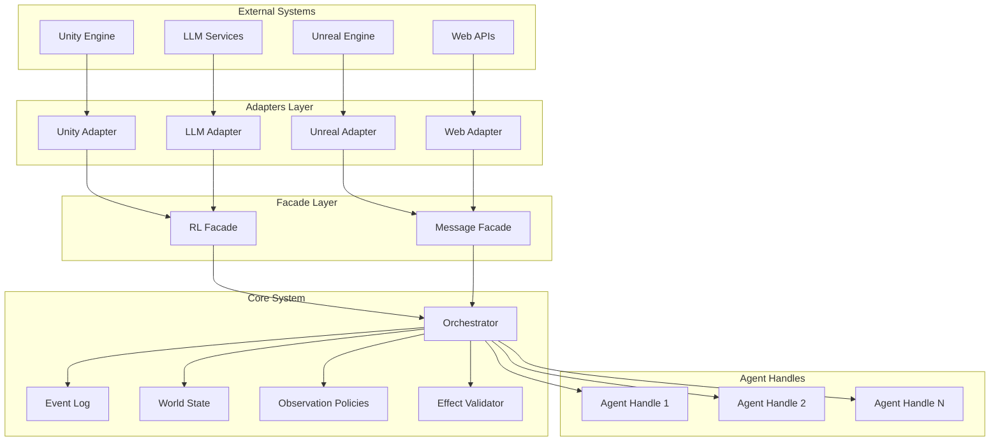
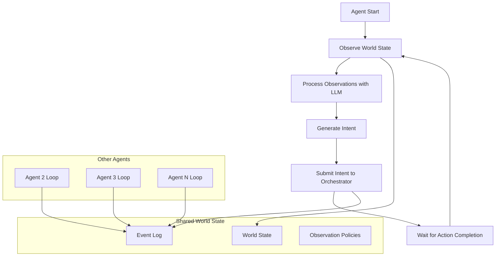

# Design Document

## Overview

The multi-agent simulation core implements an event-driven architecture with partial observation, asynchronous agent execution, and continuous observation loops. The system is built around a central event log with deterministic ordering, supporting independent agent operation where each agent follows its own observe-think-act cycle without synchronization barriers.

The core design principle is **asynchronous independence**: agents operate at their own pace, observing the world state after each action and generating new intents based on their individual LLM response timing. This enables natural conversation flows and collaborative behavior where agents can interrupt, respond, and coordinate organically.

## Architecture

### High-Level Architecture



### Asynchronous Agent Loop Architecture

The system supports an asynchronous agent execution model where each agent operates independently:



**Key Characteristics:**
- **Independent Timing**: Each agent operates at its own pace based on LLM response time
- **Continuous Observation**: Agents re-observe after every action to see changes from other agents
- **Natural Conversation**: Agents can interrupt, respond, and build on each other's messages
- **Collaborative Behavior**: Agents coordinate through observed actions and communication
- **No Synchronization Barriers**: No waiting for other agents to complete their turns

### Core Components

#### 1. Event Log (Append-Only)
- **Purpose**: Single source of truth for all system events
- **Structure**: Immutable sequence of Effects with global_seq ordering
- **Ordering**: `(sim_time, priority, source_id, uuid)` tuple for deterministic sorting
- **Persistence**: Optional disk persistence for replay/audit

#### 2. World State
- **Purpose**: Current state projection from event log
- **Update**: Rebuilt from event log or incrementally updated
- **Access**: Read-only for observation generation
- **Consistency**: Always reflects events up to latest global_seq

#### 3. Orchestrator (Central Coordinator)
- **Purpose**: Coordinates all system operations
- **Responsibilities**:
  - Event ingestion and ordering
  - View generation and delta distribution
  - Intent validation and effect creation
  - Cancellation token management
  - Backpressure and rate limiting

#### 4. Agent Handles
- **Purpose**: Per-agent interface for observation and intent submission
- **State**: Maintains agent's current view_seq
- **Isolation**: Each agent has independent observation stream
- **Concurrency**: Non-blocking operations per agent

## Components and Interfaces

### Core Data Types

```python
from typing import TypedDict, Literal, Any, List, Dict, Protocol
from pydantic import BaseModel, Field
from enum import Enum
from dataclasses import dataclass
import asyncio
import uuid
import hashlib
import heapq
import time
import orjson

# Core Types (Pydantic v2 for validation and JSON Schema)
class WorldState(BaseModel):
    entities: Dict[str, Any] = Field(default_factory=dict)
    relationships: Dict[str, List[str]] = Field(default_factory=dict)
    spatial_index: Dict[str, tuple] = Field(default_factory=dict, description="entity_id -> (x, y, z)")
    metadata: Dict[str, Any] = Field(default_factory=dict)

class View(BaseModel):
    agent_id: str
    view_seq: int
    visible_entities: Dict[str, Any]
    visible_relationships: Dict[str, List[str]]
    context_digest: str

class ObservationDelta(TypedDict):
    view_seq: int
    patches: List[Dict]  # RFC6902 JSON Patch operations with stable paths
    context_digest: str
    schema_version: str
    delivery_id: str     # For idempotent delivery and deduplication
    redelivery: bool     # Flag indicating this is a redelivery attempt

class Intent(TypedDict):
    kind: Literal["Speak", "Move", "Interact", "Custom"]
    payload: Dict[str, Any]  # See Intent Payload Specifications below
    context_seq: int
    req_id: str
    agent_id: str
    priority: int  # Higher numbers = higher priority
    schema_version: str

# Intent Payload Specifications
# Move Intent:
#   payload: {
#     "from": [x, y, z],     # Current position (3D coordinates)
#     "to": [x, y, z],       # Target position (3D coordinates)
#     "speed": float,        # Movement speed (optional)
#     "agent_id": str        # Moving agent ID
#   }
# Note: 2D coordinates [x, y] are automatically converted to 3D [x, y, 0.0]

class EffectDraft(TypedDict):
    """External input for effects - Orchestrator fills in uuid, global_seq, sim_time"""
    kind: str
    payload: Dict[str, Any]
    source_id: str
    schema_version: str

class Effect(TypedDict):
    """Complete effect with all fields filled by Orchestrator"""
    uuid: str              # Unique ID for ordering tie-breaker
    kind: str
    payload: Dict[str, Any]
    global_seq: int
    sim_time: float
    source_id: str
    schema_version: str    # Semantic versioning (e.g., "1.0.0")
    req_id: str | None     # Request ID for tracking action completion
    duration_ms: float | None  # Optional duration for interval effects
    apply_at: float | None     # Optional delayed application timestamp

class CancelToken:
    def __init__(self, req_id: str, agent_id: str):
        self.req_id = req_id
        self.agent_id = agent_id
        self._cancelled = asyncio.Event()
        self.reason: str | None = None

    @property
    def cancelled(self) -> bool:
        return self._cancelled.is_set()

    def cancel(self, reason: str):
        self.reason = reason
        self._cancelled.set()

    async def wait_cancelled(self):
        """Wait until token is cancelled"""
        await self._cancelled.wait()
```

### Orchestrator Interface

```python
class Orchestrator:
    def __init__(self, config: OrchestratorConfig, world_id: str = "default",
                 effect_validator: EffectValidator | None = None):
        self.world_id = world_id
        self.config = config
        self.event_log: EventLog = EventLog()
        self.world_state: WorldState = WorldState()
        self.observation_policies: Dict[str, ObservationPolicy] = {}
        self.effect_validator: EffectValidator = effect_validator or DefaultEffectValidator()
        self.agent_handles: Dict[str, AgentHandle] = {}
        self._global_seq: int = 0
        self._cancel_tokens: Dict[tuple, CancelToken] = {}  # (world_id, agent_id, req_id)
        self._req_id_dedup: Dict[tuple, int] = {}  # (world_id, agent_id, req_id) -> global_seq
        self._per_agent_queues: Dict[str, TimedQueue] = {}  # Timed delivery queues
        self._sim_time_authority: str = "unity"  # Which adapter controls sim_time

        # Processing order: quota → backpressure → priority → fairness

    def set_sim_time_authority(self, authority: Literal["unity", "unreal", "none"]):
        """Set which adapter controls sim_time"""
        self._sim_time_authority = authority

    async def register_agent(self, agent_id: str, policy: ObservationPolicy,
                           permissions: set[str] | None = None) -> AgentHandle:
        """Register a new agent with observation policy and permissions.

        If permissions is None, automatically sets default permissions:
        ["submit_intent", "intent:move", "intent:speak", "intent:interact", "intent:custom"]
        """

    async def broadcast_event(self, draft: EffectDraft) -> None:
        """Create complete effect from draft and distribute observations"""
        effect: Effect = {
            "uuid": uuid.uuid4().hex,
            "kind": draft["kind"],
            "payload": draft["payload"],
            "source_id": draft["source_id"],
            "schema_version": draft["schema_version"],
            "sim_time": self._current_sim_time(),
            "global_seq": self._next_seq(),
        }
        await self.event_log.append(effect)
        # distribute observations...

    async def submit_intent(self, intent: Intent) -> str:
        """Two-phase commit: idempotency check → validate intent → create effect"""

    def issue_cancel_token(self, agent_id: str, req_id: str) -> CancelToken:
        """Issue cancellation token for generation tracking"""

    async def cancel_if_stale(self, agent_id: str, req_id: str, new_view_seq: int) -> bool:
        """Check staleness and cancel if needed"""

    async def ack_observation(self, agent_id: str, delivery_id: str) -> None:
        """Acknowledge receipt of observation to prevent redelivery"""

    async def wait_effect_applied(self, req_id: str, timeout: float | None = None) -> Effect:
        """Wait for EffectApplied confirmation for the given req_id"""
```

### Agent Handle Interface

```python
class AgentHandle:
    def __init__(self, agent_id: str, orchestrator: Orchestrator):
        self.agent_id = agent_id
        self.orchestrator = orchestrator
        self.view_seq: int = 0  # Renamed to avoid shadowing
        self._running: bool = False

    async def next_observation(self) -> ObservationDelta:
        """Get next observation delta from orchestrator's timed queue"""
        timed_queue = self.orchestrator._per_agent_queues[self.agent_id]
        delta = await timed_queue.get()
        self.view_seq = delta["view_seq"]
        return delta

    async def get_current_observation(self) -> View:
        """Get current world state view for this agent"""
        policy = self.orchestrator.observation_policies[self.agent_id]
        return policy.filter_world_state(self.orchestrator.world_state, self.agent_id)

    async def submit_intent(self, intent: Intent) -> str:
        """Submit intent for validation and processing"""
        return await self.orchestrator.submit_intent(intent)

    async def cancel(self, req_id: str) -> None:
        """Cancel pending intent by req_id"""
        key = (self.orchestrator.world_id, self.agent_id, req_id)
        if key in self.orchestrator._cancel_tokens:
            self.orchestrator._cancel_tokens[key].cancel("user_requested")

    def get_view_seq(self) -> int:
        """Get current view sequence number"""
        return self.view_seq

    async def run_async_loop(self, agent_logic: 'AsyncAgentLogic') -> None:
        """Run the asynchronous observe-think-act loop for this agent"""
        self._running = True
        try:
            while self._running:
                # Observe current world state
                observation = await self.get_current_observation()
                
                # Let agent logic process observation and generate intent
                intent = await agent_logic.process_observation(observation, self.agent_id)
                
                if intent:
                    # Submit intent and wait for completion
                    req_id = await self.submit_intent(intent)
                    
                    # Wait for the action to be processed
                    await self._wait_for_action_completion(req_id)
                
                # Small delay to prevent busy waiting
                await asyncio.sleep(0.1)
        except Exception as e:
            # Log error and stop loop
            self._running = False
            raise

    def stop_async_loop(self) -> None:
        """Stop the asynchronous agent loop"""
        self._running = False

    async def ack_observation(self, delivery_id: str) -> None:
        """Acknowledge receipt of observation to prevent redelivery"""
        await self.orchestrator.ack_observation(self.agent_id, delivery_id)

    async def _wait_for_action_completion(self, req_id: str) -> None:
        """Wait for the submitted action to be processed and reflected in world state"""
        try:
            await self.orchestrator.wait_effect_applied(req_id, timeout=30.0)
        except asyncio.TimeoutError:
            # Log timeout but continue - agent can still observe and react
            pass
```

### Asynchronous Agent Logic Interface

```python
from abc import ABC, abstractmethod

class AsyncAgentLogic(ABC):
    """Abstract base class for implementing asynchronous agent behavior"""
    
    @abstractmethod
    async def process_observation(self, observation: View, agent_id: str) -> Intent | None:
        """Process current observation and return intent to execute, or None to wait"""
        pass

class ConversationalAgent(AsyncAgentLogic):
    """Example implementation for conversational agents"""
    
    def __init__(self, llm_client, personality: str = "helpful"):
        self.llm_client = llm_client
        self.personality = personality
        self.conversation_history: List[str] = []
    
    async def process_observation(self, observation: View, agent_id: str) -> Intent | None:
        # Extract relevant information from observation
        nearby_agents = self._get_nearby_agents(observation)
        recent_messages = self._get_recent_messages(observation)
        
        # Build context for LLM
        context = self._build_context(nearby_agents, recent_messages, agent_id)
        
        # Generate response using LLM
        response = await self.llm_client.generate_response(context, self.personality)
        
        if response.action_type == "speak":
            return Intent(
                kind="Speak",
                payload={"text": response.text, "agent_id": agent_id},
                context_seq=observation.view_seq,
                req_id=str(uuid.uuid4()),
                agent_id=agent_id,
                priority=0,
                schema_version="1.0.0"
            )
        elif response.action_type == "move":
            return Intent(
                kind="Move", 
                payload={"to": response.target_position, "agent_id": agent_id},
                context_seq=observation.view_seq,
                req_id=str(uuid.uuid4()),
                agent_id=agent_id,
                priority=0,
                schema_version="1.0.0"
            )
        
        return None  # No action needed
    
    def _get_nearby_agents(self, observation: View) -> List[Dict]:
        """Extract information about nearby agents from observation"""
        pass
    
    def _get_recent_messages(self, observation: View) -> List[Dict]:
        """Extract recent messages from observation"""
        pass
    
    def _build_context(self, nearby_agents: List, recent_messages: List, agent_id: str) -> str:
        """Build context string for LLM"""
        pass
```

### Observation Policy Interface

```python
class ObservationPolicy:
    def __init__(self, config: PolicyConfig):
        self.distance_limit: float = config.distance_limit
        self.relationship_filter: List[str] = config.relationship_filter
        self.field_visibility: Dict[str, bool] = config.field_visibility
        self.latency_model: LatencyModel = config.latency_model

    def filter_world_state(self, world_state: WorldState, agent_id: str) -> View:
        """Generate agent's view from world state"""

    def should_observe_event(self, effect: Effect, agent_id: str, world_state: WorldState) -> bool:
        """Determine if agent should see this effect"""

    def calculate_observation_delta(self, old_view: View, new_view: View) -> ObservationDelta:
        """Generate RFC6902 JSON Patch between views"""

    def is_intent_stale(self, intent: Intent, since_seq: int, world_state: WorldState) -> bool:
        """Check if changes since since_seq make the intent's preconditions invalid"""
        # Default implementation: any change triggers staleness
        # Subclasses should override for intent-specific logic
        return True
```

## Data Models

### Event Log Schema

```python
class EventLogEntry(BaseModel):
    global_seq: int
    sim_time: float
    wall_time: float
    effect: Effect
    source_metadata: Dict[str, Any]
    checksum: str  # Hash chain: hash(effect_json + prev_checksum)
    req_id: str    # For idempotency checking

class EventLog:
    def __init__(self):
        self._entries: List[EventLogEntry] = []
        self._seq_counter: int = 0
        self._lock = asyncio.Lock()

    async def append(self, effect: Effect) -> int:
        """Append effect with hash chain checksum and return global_seq"""
        async with self._lock:
            prev_checksum = self._entries[-1].checksum if self._entries else None
            checksum = chain_checksum(effect, prev_checksum)

            entry = EventLogEntry(
                global_seq=effect["global_seq"],
                sim_time=effect["sim_time"],
                wall_time=time.time(),
                effect=effect,
                source_metadata={},
                checksum=checksum,
                req_id=effect.get("req_id", "")
            )

            self._entries.append(entry)
            return effect["global_seq"]

    def get_entries_since(self, since_seq: int) -> List[EventLogEntry]:
        """Get entries for replay/catch-up"""

    def validate_integrity(self) -> bool:
        """Validate log integrity using checksums"""
```

### Spatial and Relationship Models

```python
@dataclass
class SpatialEntity:
    entity_id: str
    position: tuple  # (x, y, z)
    bounds: tuple    # (width, height, depth)
    visibility_range: float

@dataclass
class Relationship:
    from_entity: str
    to_entity: str
    relationship_type: str
    strength: float
    metadata: Dict[str, Any]

class SpatialIndex:
    """R-tree or similar for efficient spatial queries"""
    def entities_within_range(self, center: tuple, radius: float) -> List[str]:
        pass

    def entities_in_view_cone(self, observer: tuple, direction: tuple, angle: float, range: float) -> List[str]:
        pass
```

## Error Handling

### Error Types and Recovery

```python
class SimulationError(Exception):
    """Base exception for simulation errors"""
    pass

class StaleContextError(SimulationError):
    def __init__(self, req_id: str, expected_seq: int, actual_seq: int):
        self.req_id = req_id
        self.expected_seq = expected_seq
        self.actual_seq = actual_seq

class IntentConflictError(SimulationError):
    def __init__(self, intent: Intent, conflicting_effects: List[Effect]):
        self.intent = intent
        self.conflicting_effects = conflicting_effects

class QuotaExceededError(SimulationError):
    def __init__(self, agent_id: str, quota_type: str, limit: int):
        self.agent_id = agent_id
        self.quota_type = quota_type
        self.limit = limit

# Recovery Actions and Circuit Breaker Errors
class RecoveryAction(Enum):
    RETRY = "retry"
    ABORT = "abort"
    REGENERATE = "regenerate"
    RETRY_WITH_DELAY = "retry_with_delay"
    MODIFY_INTENT = "modify_intent"
    DEFER = "defer"
    SHED_OLDEST = "shed_oldest"

class CircuitBreakerOpenError(Exception):
    """Raised when circuit breaker is open"""
    pass

class TimedQueue:
    """Priority queue for timed delivery with latency simulation"""
    def __init__(self):
        self._heap: List[tuple] = []
        self._cv = asyncio.Condition()
        self._seq = 0

    async def put_at(self, deliver_at: float, item: Any):
        """Schedule item for delivery at specific time"""
        async with self._cv:
            self._seq += 1
            heapq.heappush(self._heap, (deliver_at, self._seq, item))
            self._cv.notify()

    async def get(self) -> Any:
        """Get next item when its delivery time arrives"""
        while True:
            async with self._cv:
                if not self._heap:
                    await self._cv.wait()
                    continue

                deliver_at, _, item = self._heap[0]
                now = asyncio.get_running_loop().time()
                delay = deliver_at - now

                if delay <= 0:
                    heapq.heappop(self._heap)
                    return item

            # Sleep outside the lock to avoid blocking other operations
            if delay > 0:
                await asyncio.sleep(delay)

# Hash chain utilities for log integrity
def canonical_json(obj: dict) -> bytes:
    """Canonical JSON serialization for consistent hashing"""
    return orjson.dumps(obj, option=orjson.OPT_SORT_KEYS)

def chain_checksum(effect: dict, prev_checksum: str | None) -> str:
    """Generate hash chain checksum: SHA-256(prev_checksum + canonical_json(effect))"""
    h = hashlib.sha256()
    if prev_checksum:
        h.update(prev_checksum.encode())
    h.update(canonical_json(effect))
    return h.hexdigest()

# Error Recovery Strategies
class ErrorRecoveryPolicy:
    def handle_stale_context(self, error: StaleContextError) -> RecoveryAction:
        """Return RETRY, ABORT, or REGENERATE"""

    def handle_intent_conflict(self, error: IntentConflictError) -> RecoveryAction:
        """Return RETRY_WITH_DELAY, ABORT, or MODIFY_INTENT"""

    def handle_quota_exceeded(self, error: QuotaExceededError) -> RecoveryAction:
        """Return DEFER, ABORT, or SHED_OLDEST"""
```

### Circuit Breaker Pattern

```python
class CircuitBreaker:
    def __init__(self, failure_threshold: int = 5, recovery_timeout: float = 30.0):
        self.failure_threshold = failure_threshold
        self.recovery_timeout = recovery_timeout
        self.failure_count = 0
        self.last_failure_time = 0
        self.state = "CLOSED"  # CLOSED, OPEN, HALF_OPEN

    async def call(self, func, *args, **kwargs):
        """Execute function with circuit breaker protection"""
        if self.state == "OPEN":
            if time.time() - self.last_failure_time > self.recovery_timeout:
                self.state = "HALF_OPEN"
            else:
                raise CircuitBreakerOpenError()

        try:
            result = await func(*args, **kwargs)
            if self.state == "HALF_OPEN":
                self.state = "CLOSED"
                self.failure_count = 0
            return result
        except Exception as e:
            self.failure_count += 1
            self.last_failure_time = time.time()
            if self.failure_count >= self.failure_threshold:
                self.state = "OPEN"
            raise
```

## Testing Strategy

### Unit Testing Approach

1. **Event Log Testing**
   - Deterministic ordering validation
   - Integrity checking with corrupted logs
   - Concurrent append operations
   - Replay consistency verification

2. **Observation Policy Testing**
   - Distance-based filtering accuracy
   - Relationship filtering correctness
   - JSON Patch generation validation
   - Latency model simulation

3. **Orchestrator Testing**
   - Two-phase commit validation
   - Staleness detection accuracy
   - Cancellation token behavior
   - Backpressure policy enforcement

### Integration Testing

1. **Multi-Agent Scenarios**
   - Concurrent intent submission
   - Interruption and regeneration flows
   - Cross-agent observation consistency
   - Fairness and priority enforcement

2. **Performance Testing**
   - Latency SLO validation (20ms observation delivery)
   - Throughput testing (100 intents/sec per agent)
   - Cancellation responsiveness (100ms cancel-to-halt)
   - Memory usage under sustained load

3. **Fault Tolerance Testing**
   - Network partition simulation
   - Adapter failure recovery
   - Log corruption detection
   - Circuit breaker activation

### End-to-End Testing

```python
async def test_conversation_with_interruption():
    """Test A/B/C conversation with B interrupting A's generation"""
    orchestrator = Orchestrator(config)

    # Register agents
    agent_a = await orchestrator.register_agent("A", conversation_policy)
    agent_b = await orchestrator.register_agent("B", conversation_policy)
    agent_c = await orchestrator.register_agent("C", conversation_policy)

    # A starts generating response
    cancel_token = orchestrator.issue_cancel_token("A", "req_1")

    # B emits message while A is generating
    await orchestrator.broadcast_event(EffectDraft(
        kind="MessageEmitted",
        payload={"text": "Wait, I have something important!"},
        source_id="B",
        schema_version="1.0.0"
    ))

    # Verify A's generation is cancelled
    assert cancel_token.cancelled
    assert cancel_token.reason.startswith("stale_due_to")

    # Verify C receives both messages in correct order
    delta_1 = await agent_c.next_observation()
    delta_2 = await agent_c.next_observation()

    assert delta_1.view_seq < delta_2.view_seq
```

## Key Design Principles

### Ordering and Time Authority
- **Deterministic ordering**: `(sim_time, priority, source_id, uuid)` with higher priority numbers taking precedence
- **Time authority**: Unity/Unreal adapters control `sim_time`, Web/API adapters use `wall_time`
- **Tie-breaking**: priority > source_id > UUID lexicographic for reproducible ordering

### Policy Separation
- **ObservationPolicy**: Handles visibility (what agents can see) - depends only on WorldState
- **EffectValidator**: Handles permissions (what agents can do) - depends only on WorldState
- **No cross-dependencies**: Policies never reference each other directly

### Stable Path Design
- **Entity IDs**: Use stable, semantic identifiers (not array indices)
- **JSON Patch paths**: Design for stability across entity reordering/renaming
- **Remove operations**: Configurable per policy (default: emit "remove" for observed disappearances)

### Latency and Cancellation
- **100ms cancellation SLO**: Measured from cancel signal to next token boundary halt
- **Token yield interval**: LLM adapters must yield control every 20-30ms maximum
- **Delivery latency**: Per-agent queues with minimum heap for timed delivery

### Memory and Compaction
- **WorldState snapshots**: Every N events (configurable, default: 1000) for faster replay
- **Log compaction**: Preserve replay capability while reducing memory footprint
- **View caching**: LRU cache with configurable size per agent

## Performance Considerations

### Optimization Strategies

1. **Event Log Optimization**
   - Batch writes for high-throughput scenarios
   - Periodic compaction for long-running simulations
   - Memory-mapped files for large logs
   - Parallel replay for faster startup

2. **Observation Generation**
   - Incremental view updates instead of full regeneration
   - Spatial indexing for distance-based policies
   - Cached relationship graphs
   - Lazy evaluation of complex filters

3. **Concurrency Optimization**
   - Lock-free data structures where possible
   - Agent-specific thread pools
   - Async I/O for all external communications
   - Batched observation delivery

### Configuration Protocols

```python
class OrchestratorConfig(Protocol):
    max_agents: int
    staleness_threshold: int
    debounce_ms: float
    deadline_ms: float
    token_budget: int
    backpressure_policy: str
    default_priority: int  # Default priority when not specified (e.g., 0)

class PolicyConfig(Protocol):
    distance_limit: float
    relationship_filter: List[str]
    field_visibility: Dict[str, bool]
    latency_model: 'LatencyModel'

class LatencyModel(Protocol):
    def calculate_delay(self, from_agent: str, to_agent: str, effect: Effect) -> float:
        """Calculate delivery delay in seconds"""

class EffectValidator(Protocol):
    def validate_intent(self, intent: Intent, world_state: WorldState) -> bool:
        """Validate if intent can be executed"""

class DefaultEffectValidator:
    """Default implementation of EffectValidator with 2D/3D coordinate support"""
    def validate_intent(self, intent: Intent, world_state: WorldState) -> bool:
        # Validate agent permissions
        # For Move intents: validate position format and convert 2D to 3D
        if intent["kind"] == "Move":
            return self._validate_move_intent(intent, world_state)
        return True

    def _validate_move_intent(self, intent: Intent, world_state: WorldState) -> bool:
        """Validate Move intent with automatic 2D to 3D coordinate conversion"""
        payload = intent["payload"]
        position = payload.get("to") or payload.get("position")  # Support both formats

        if not position or not isinstance(position, (list, tuple)):
            return False

        # Accept both 2D and 3D coordinates
        if len(position) == 2:
            # Convert 2D to 3D automatically
            position = [float(position[0]), float(position[1]), 0.0]
        elif len(position) == 3:
            position = [float(x) for x in position]
        else:
            return False  # Invalid coordinate format

        return True
```

### System Invariants

The system maintains these critical invariants:

1. **Monotonic Ordering**: `global_seq` is strictly monotonically increasing
2. **View Consistency**: Each `AgentHandle.view_seq <= latest_global_seq`
3. **Patch Validity**: ObservationDelta JSON Patches only reference existing paths
4. **Two-Phase Integrity**: `submit_intent()` creates Effect only after staleness/quota/validation checks pass
5. **Log Integrity**: `EventLog.validate_integrity()` verifies complete hash chain
6. **UUID Uniqueness**: Each `Effect.uuid` is globally unique (using `uuid4().hex`)

### Observation Delivery System

```python
class DeliveryTracker:
    """Tracks observation delivery and handles redelivery for reliability"""
    def __init__(self):
        self._pending_deliveries: Dict[tuple, ObservationDelta] = {}  # (agent_id, delivery_id)
        self._delivery_timeouts: Dict[tuple, float] = {}  # (agent_id, delivery_id) -> timeout
        self._redelivery_config = RedeliveryConfig(
            initial_timeout=5.0,
            max_retries=3,
            backoff_multiplier=2.0
        )

    async def schedule_delivery(self, agent_id: str, delta: ObservationDelta) -> None:
        """Schedule observation delivery with timeout tracking"""
        delivery_id = delta["delivery_id"]
        key = (agent_id, delivery_id)
        
        self._pending_deliveries[key] = delta
        self._delivery_timeouts[key] = time.time() + self._redelivery_config.initial_timeout
        
        # Schedule to agent's timed queue
        await self._deliver_to_agent(agent_id, delta)

    async def acknowledge_delivery(self, agent_id: str, delivery_id: str) -> bool:
        """Mark delivery as acknowledged and remove from pending"""
        key = (agent_id, delivery_id)
        if key in self._pending_deliveries:
            del self._pending_deliveries[key]
            del self._delivery_timeouts[key]
            return True
        return False

    async def check_redeliveries(self) -> None:
        """Check for timed-out deliveries and schedule redelivery"""
        now = time.time()
        for key, timeout in list(self._delivery_timeouts.items()):
            if now > timeout:
                agent_id, delivery_id = key
                delta = self._pending_deliveries[key]
                
                # Mark as redelivery and reschedule
                delta["redelivery"] = True
                await self._deliver_to_agent(agent_id, delta)
                
                # Update timeout with backoff
                self._delivery_timeouts[key] = now + (
                    self._redelivery_config.initial_timeout * 
                    self._redelivery_config.backoff_multiplier
                )

class QuotaController:
    """Token bucket implementation for fair resource allocation"""
    def __init__(self, config: QuotaConfig):
        self._buckets: Dict[str, TokenBucket] = {}
        self._config = config

    def allow(self, agent_id: str, cost: int = 1) -> bool:
        """Check if agent can perform action based on quota"""
        if agent_id not in self._buckets:
            self._buckets[agent_id] = TokenBucket(
                capacity=self._config.bucket_capacity,
                refill_rate=self._config.refill_rate
            )
        
        return self._buckets[agent_id].consume(cost)

    def get_quota_status(self, agent_id: str) -> QuotaStatus:
        """Get current quota status for agent"""
        if agent_id not in self._buckets:
            return QuotaStatus(available=self._config.bucket_capacity, capacity=self._config.bucket_capacity)
        
        bucket = self._buckets[agent_id]
        return QuotaStatus(available=bucket.available, capacity=bucket.capacity)

class TokenBucket:
    """Token bucket for rate limiting with refill"""
    def __init__(self, capacity: int, refill_rate: float):
        self.capacity = capacity
        self.available = capacity
        self.refill_rate = refill_rate  # tokens per second
        self.last_refill = time.time()

    def consume(self, tokens: int) -> bool:
        """Try to consume tokens, return True if successful"""
        self._refill()
        if self.available >= tokens:
            self.available -= tokens
            return True
        return False

    def _refill(self) -> None:
        """Refill tokens based on elapsed time"""
        now = time.time()
        elapsed = now - self.last_refill
        tokens_to_add = int(elapsed * self.refill_rate)
        
        if tokens_to_add > 0:
            self.available = min(self.capacity, self.available + tokens_to_add)
            self.last_refill = now

class PriorityAging:
    """Implements priority aging to prevent starvation"""
    def __init__(self, aging_rate: float = 0.1):
        self.aging_rate = aging_rate  # priority increase per second
        self._submission_times: Dict[str, float] = {}  # req_id -> submission_time

    def calculate_effective_priority(self, req_id: str, base_priority: int) -> float:
        """Calculate priority with aging based on wait time"""
        if req_id not in self._submission_times:
            self._submission_times[req_id] = time.time()
            return float(base_priority)
        
        wait_time = time.time() - self._submission_times[req_id]
        aging_bonus = wait_time * self.aging_rate
        return float(base_priority) + aging_bonus

    def remove_request(self, req_id: str) -> None:
        """Remove request from aging tracking"""
        self._submission_times.pop(req_id, None)
```

### Action Completion Tracking

```python
class ActionCompletionTracker:
    """Tracks action completion and provides confirmation to agents"""
    def __init__(self):
        self._pending_actions: Dict[str, asyncio.Future] = {}  # req_id -> Future[Effect]
        self._completion_timeout = 30.0

    def register_action(self, req_id: str) -> asyncio.Future[Effect]:
        """Register an action and return future for completion"""
        future = asyncio.Future()
        self._pending_actions[req_id] = future
        
        # Set timeout
        asyncio.create_task(self._timeout_action(req_id, future))
        return future

    async def complete_action(self, req_id: str, result: Effect) -> None:
        """Mark action as completed with result"""
        if req_id in self._pending_actions:
            future = self._pending_actions.pop(req_id)
            if not future.done():
                future.set_result(result)

    async def fail_action(self, req_id: str, error: Exception) -> None:
        """Mark action as failed with error"""
        if req_id in self._pending_actions:
            future = self._pending_actions.pop(req_id)
            if not future.done():
                future.set_exception(error)

    async def _timeout_action(self, req_id: str, future: asyncio.Future) -> None:
        """Timeout an action if it takes too long"""
        await asyncio.sleep(self._completion_timeout)
        if not future.done():
            future.set_exception(asyncio.TimeoutError(f"Action {req_id} timed out"))
            self._pending_actions.pop(req_id, None)
```

### Intelligent Staleness Detection

```python
class SpatialObservationPolicy(ObservationPolicy):
    """Observation policy with spatial-aware staleness detection"""
    
    def is_intent_stale(self, intent: Intent, since_seq: int, world_state: WorldState) -> bool:
        """Check staleness based on intent type and spatial relevance"""
        if intent["kind"] == "Move":
            return self._is_move_intent_stale(intent, since_seq, world_state)
        elif intent["kind"] == "Speak":
            return self._is_speak_intent_stale(intent, since_seq, world_state)
        else:
            # Default: any change triggers staleness
            return True

    def _is_move_intent_stale(self, intent: Intent, since_seq: int, world_state: WorldState) -> bool:
        """Check if move intent is stale based on spatial changes"""
        target_pos = intent["payload"].get("to")
        if not target_pos:
            return True
        
        # Check if target area has been occupied or blocked
        # Check if navigation mesh has changed
        # Check if agent's current position has changed significantly
        
        agent_id = intent["agent_id"]
        current_pos = world_state.spatial_index.get(agent_id)
        
        # Simple implementation: check if any entity moved near target
        for entity_id, pos in world_state.spatial_index.items():
            if entity_id != agent_id:
                distance_to_target = self._calculate_distance(pos, target_pos)
                if distance_to_target < 2.0:  # Within 2 units of target
                    return True
        
        return False

    def _is_speak_intent_stale(self, intent: Intent, since_seq: int, world_state: WorldState) -> bool:
        """Check if speak intent is stale based on conversation changes"""
        # Check if conversation context has changed
        # Check if target participants have moved away
        # Check if new messages have been posted to the same conversation
        
        agent_id = intent["agent_id"]
        agent_pos = world_state.spatial_index.get(agent_id)
        
        if not agent_pos:
            return True
        
        # Check if nearby agents have changed (conversation participants)
        nearby_agents = []
        for entity_id, pos in world_state.spatial_index.items():
            if entity_id != agent_id:
                distance = self._calculate_distance(agent_pos, pos)
                if distance < 5.0:  # Within conversation range
                    nearby_agents.append(entity_id)
        
        # Simple heuristic: if nearby agents changed, conversation context may be stale
        # More sophisticated implementation would track conversation threads
        return len(nearby_agents) != intent["payload"].get("expected_participants", 0)

    def _calculate_distance(self, pos1: tuple, pos2: tuple) -> float:
        """Calculate Euclidean distance between two positions"""
        if len(pos1) >= 2 and len(pos2) >= 2:
            return ((pos1[0] - pos2[0]) ** 2 + (pos1[1] - pos2[1]) ** 2) ** 0.5
        return float('inf')
```

### Replay Invariance Testing

```python
class ReplayInvarianceValidator:
    """Validates that incremental updates match full replay results"""
    
    def __init__(self, orchestrator: Orchestrator):
        self.orchestrator = orchestrator

    async def assert_replay_equivalence(self, event_log: EventLog, world_state: WorldState) -> None:
        """Verify current world state matches full replay from event log"""
        # Create fresh orchestrator for replay
        replay_orchestrator = Orchestrator(self.orchestrator.config)
        
        # Replay all events
        entries = event_log.get_entries_since(0)
        for entry in entries:
            await replay_orchestrator._apply_effect_to_world_state(entry.effect)
        
        # Compare world states
        if not self._world_states_equal(world_state, replay_orchestrator.world_state):
            raise ReplayInvarianceError(
                "World state mismatch between incremental and replay",
                current=world_state,
                replayed=replay_orchestrator.world_state
            )

    def _world_states_equal(self, state1: WorldState, state2: WorldState) -> bool:
        """Deep comparison of world states"""
        return (
            state1.entities == state2.entities and
            state1.relationships == state2.relationships and
            state1.spatial_index == state2.spatial_index and
            state1.metadata == state2.metadata
        )

class ReplayInvarianceError(Exception):
    """Raised when replay invariance is violated"""
    def __init__(self, message: str, current: WorldState, replayed: WorldState):
        super().__init__(message)
        self.current = current
        self.replayed = replayed
```

### Memory Management

```python
class MemoryManager:
    def __init__(self, config: MemoryConfig):
        self.max_log_entries = config.max_log_entries
        self.view_cache_size = config.view_cache_size
        self.compaction_threshold = config.compaction_threshold

    async def compact_log(self, event_log: EventLog) -> None:
        """Compact old log entries while preserving replay capability"""

    def evict_old_views(self, agent_handles: Dict[str, AgentHandle]) -> None:
        """Remove old cached views to free memory"""

    def estimate_memory_usage(self) -> MemoryStats:
        """Return current memory usage statistics"""
```

This design provides a comprehensive foundation for implementing the multi-agent simulation core with all the critical specifications: reliable observation delivery, action completion confirmation, intelligent staleness detection, fair resource allocation, temporal authority handling, and replay invariance validation. The architecture supports truly asynchronous agent behavior while maintaining system consistency and reliability.eatures: partial observation, concurrent execution, intelligent interruption, dual facades, and robust error handling. The architecture is modular, testable, and scalable.
