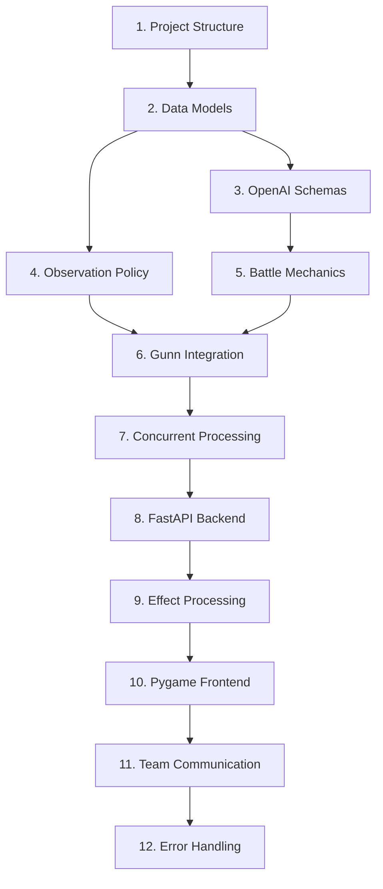

# Development Guide

This guide provides detailed information for developers working on the Gunn Battle Demo.

## Development Setup

### Environment Configuration

1. **Clone and setup:**
   ```bash
   git clone <repository-url>
   cd gunn
   uv sync --group demo --group dev
   ```

2. **Environment variables:**
   ```bash
   # Required for AI decision making
   export OPENAI_API_KEY="your-openai-api-key"
   
   # Optional development settings
   export DEMO_DEBUG=true
   export DEMO_LOG_LEVEL=DEBUG
   export DEMO_BACKEND_HOST=localhost
   export DEMO_BACKEND_PORT=8000
   ```

3. **Pre-commit hooks:**
   ```bash
   uv run pre-commit install
   ```

## Project Structure Deep Dive

### Backend Architecture

```
demo/backend/
├── server.py              # FastAPI application and routes
├── game_manager.py        # Game lifecycle and state management
├── battle_mechanics.py    # Combat calculations and rules
├── ai_decision.py         # OpenAI structured output integration
└── gunn_integration.py    # Gunn orchestrator wrapper and policies
```

**Key Components:**

- **BattleAPIServer:** FastAPI app with REST endpoints and WebSocket handlers
- **GameManager:** Coordinates between Gunn orchestrator and game logic
- **BattleMechanics:** Handles damage, healing, weapon degradation
- **AIDecisionMaker:** Interfaces with OpenAI for agent decisions
- **BattleOrchestrator:** Wraps Gunn's Orchestrator with battle-specific logic

### Frontend Architecture

```
demo/frontend/
├── renderer.py            # Main Pygame rendering loop
├── ui_components.py       # Reusable UI elements
├── input_handler.py       # Keyboard/mouse input processing
└── api_client.py          # Backend communication
```

**Key Components:**

- **BattleRenderer:** Main game loop, rendering, and display management
- **UIComponents:** Health bars, team indicators, message displays
- **InputHandler:** User input processing and game controls
- **BattleAPIClient:** HTTP and WebSocket communication with backend

### Shared Components

```
demo/shared/
├── models.py              # Pydantic data models
├── schemas.py             # OpenAI structured output schemas
├── enums.py               # Game state enumerations
├── constants.py           # Configuration and game settings
└── utils.py               # Helper functions and utilities
```

## Implementation Tasks

The demo is built following a structured task-based approach. See `.kiro/specs/multi-agent-battle-demo/tasks.md` for the complete implementation plan.

### Task Dependencies



### Current Status

- ✅ Task 1: Project structure and dependencies
- ⏳ Task 2: Core battle data models (in progress)
- ⏸️ Tasks 3-20: Pending implementation

## Development Workflow

### Adding New Features

1. **Create a branch:**
   ```bash
   git checkout -b feature/new-feature-name
   ```

2. **Implement changes:**
   - Follow the task-based approach in `tasks.md`
   - Update relevant tests
   - Add documentation

3. **Test your changes:**
   ```bash
   # Run specific tests
   uv run --group demo pytest demo/backend/tests/test_new_feature.py
   
   # Run all demo tests
   uv run --group demo pytest demo/
   
   # Integration test
   uv run --group demo python -m demo.backend.server --test-mode
   ```

4. **Code quality checks:**
   ```bash
   uv run ruff format demo/
   uv run ruff check demo/
   uv run mypy demo/
   ```

### Testing Strategy

#### Unit Tests
- Located alongside source files: `demo/*/test_*.py`
- Test individual components in isolation
- Mock external dependencies (OpenAI, Gunn)

#### Integration Tests
- Located in `demo/tests/integration/`
- Test component interactions
- Use test databases and mock services

#### End-to-End Tests
- Located in `demo/tests/e2e/`
- Test complete workflows
- Require running backend and frontend

### Debugging

#### Backend Debugging
```bash
# Run with debug logging
DEMO_DEBUG=true uv run --group demo python -m demo.backend.server

# Use debugger
uv run --group demo python -m pdb demo/backend/server.py
```

#### Frontend Debugging
```bash
# Run with debug overlay
DEMO_DEBUG=true uv run --group demo python -m demo.frontend.renderer

# Mock backend for frontend testing
uv run --group demo python -m demo.frontend.renderer --mock-backend
```

#### Gunn Integration Debugging
```bash
# Enable Gunn debug logging
export GUNN_LOG_LEVEL=DEBUG
uv run --group demo python -m demo.backend.gunn_integration --debug
```

## Code Style and Standards

### Python Style
- Follow PEP 8 with Ruff formatting
- Use type hints for all function signatures
- Prefer modern Python features (3.13+)
- Use Pydantic for data validation

### Async/Await Patterns
```python
# Preferred async patterns
async def process_agent_decision(agent_id: str) -> AgentDecision:
    async with httpx.AsyncClient() as client:
        response = await client.post("/api/decision", json={"agent_id": agent_id})
        return AgentDecision.model_validate(response.json())

# Use asyncio.gather for concurrent operations
decisions = await asyncio.gather(*[
    process_agent_decision(agent_id) 
    for agent_id in active_agents
])
```

### Error Handling
```python
# Use structured exceptions
class BattleError(Exception):
    """Base exception for battle-related errors."""
    pass

class InvalidActionError(BattleError):
    """Raised when an agent attempts an invalid action."""
    def __init__(self, agent_id: str, action: str, reason: str):
        self.agent_id = agent_id
        self.action = action
        self.reason = reason
        super().__init__(f"Invalid action {action} by {agent_id}: {reason}")
```

### Logging
```python
import structlog

logger = structlog.get_logger(__name__)

# Structured logging with context
logger.info(
    "Agent decision processed",
    agent_id=agent_id,
    action_type=decision.primary_action.action_type,
    confidence=decision.confidence,
    duration_ms=processing_time * 1000
)
```

## Performance Considerations

### Backend Performance
- Use async/await for I/O operations
- Implement connection pooling for database access
- Cache frequently accessed game state
- Use WebSocket for real-time updates instead of polling

### Frontend Performance
- Limit rendering to 60 FPS
- Use sprite groups for efficient rendering
- Implement view culling for off-screen objects
- Cache rendered UI elements

### AI Decision Performance
- Implement request batching for OpenAI API
- Use connection pooling for HTTP requests
- Add timeout handling for slow responses
- Cache decision patterns for similar situations

## Security Considerations

### API Security
- Validate all input data with Pydantic
- Implement rate limiting for API endpoints
- Use CORS appropriately for frontend access
- Sanitize user inputs and error messages

### OpenAI Integration
- Secure API key storage (environment variables)
- Implement request quotas and limits
- Validate structured output responses
- Handle API failures gracefully

## Deployment

### Local Development
```bash
# Start backend
uv run --group demo uvicorn demo.backend.server:app --reload

# Start frontend
uv run --group demo python -m demo.frontend.renderer
```

### Production Deployment
```bash
# Build distribution
uv build

# Run with production settings
uv run --group demo uvicorn demo.backend.server:app --host 0.0.0.0 --port 8000
```

### Docker Deployment
```dockerfile
FROM python:3.13-slim

WORKDIR /app
COPY . .

RUN pip install uv
RUN uv sync --group demo

EXPOSE 8000
CMD ["uv", "run", "--group", "demo", "uvicorn", "demo.backend.server:app", "--host", "0.0.0.0"]
```

## Contributing

### Pull Request Process

1. **Fork and branch:** Create a feature branch from main
2. **Implement:** Follow the task-based development approach
3. **Test:** Ensure all tests pass and add new tests for features
4. **Document:** Update relevant documentation and docstrings
5. **Review:** Submit PR with clear description and test results

### Code Review Checklist

- [ ] Code follows style guidelines (Ruff, MyPy)
- [ ] All tests pass (unit, integration, e2e)
- [ ] Documentation is updated
- [ ] Performance impact is considered
- [ ] Security implications are reviewed
- [ ] Backward compatibility is maintained

### Release Process

1. **Version bump:** Update version in `demo/__init__.py`
2. **Changelog:** Update `CHANGELOG.md` with new features
3. **Tag release:** Create git tag with version number
4. **Build:** Generate distribution packages
5. **Deploy:** Update deployment environments

## Troubleshooting

### Common Development Issues

1. **Import Errors:**
   ```bash
   # Ensure demo dependencies are installed
   uv sync --group demo
   
   # Check Python path
   export PYTHONPATH="${PYTHONPATH}:$(pwd)"
   ```

2. **OpenAI API Issues:**
   ```bash
   # Test API connection
   uv run --group demo python -c "
   import openai
   client = openai.OpenAI()
   print(client.models.list())
   "
   ```

3. **Pygame Display Issues:**
   ```bash
   # Install system dependencies (Ubuntu/Debian)
   sudo apt-get install python3-pygame libsdl2-dev
   
   # Test Pygame installation
   uv run --group demo python -c "import pygame; pygame.init(); print('Pygame OK')"
   ```

4. **WebSocket Connection Issues:**
   ```bash
   # Test WebSocket connection
   uv run --group demo python -c "
   import asyncio
   import websockets
   
   async def test():
       async with websockets.connect('ws://localhost:8000/ws/game') as ws:
           print('WebSocket connection OK')
   
   asyncio.run(test())
   "
   ```

### Performance Debugging

1. **Profile backend performance:**
   ```bash
   uv run --group demo python -m cProfile -o profile.stats demo/backend/server.py
   uv run --group demo python -c "
   import pstats
   p = pstats.Stats('profile.stats')
   p.sort_stats('cumulative').print_stats(20)
   "
   ```

2. **Monitor memory usage:**
   ```bash
   uv run --group demo python -m memory_profiler demo/backend/server.py
   ```

3. **Frontend performance:**
   ```bash
   # Enable FPS display
   DEMO_SHOW_FPS=true uv run --group demo python -m demo.frontend.renderer
   ```

For additional help, consult the main Gunn documentation or open an issue in the repository.